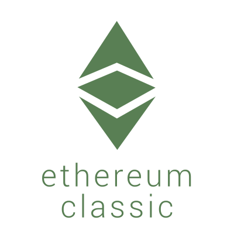
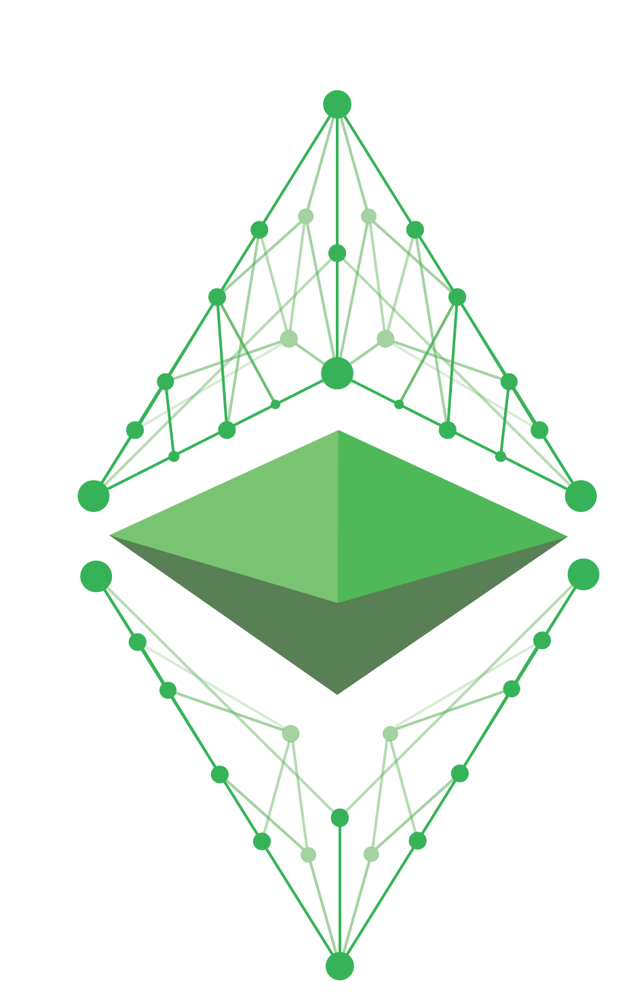
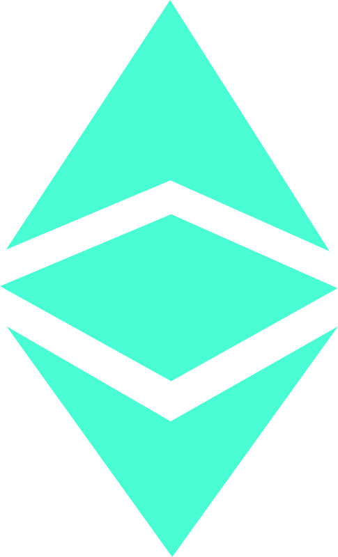
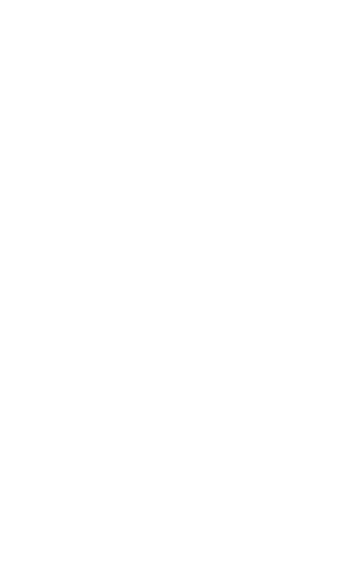
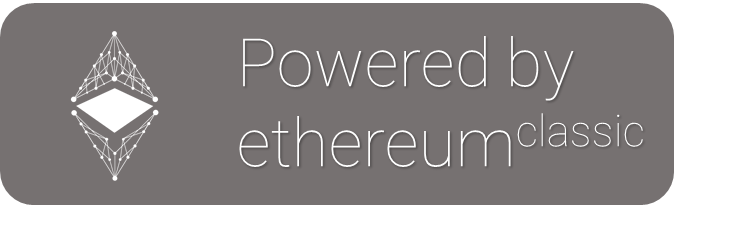
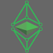

  
  

# Media Kit

Media and press professionals may use Ethereum Classic logos, trademarks, images and colors by referring and adhering to the instructions in the Brand Guidelines documents.

# Brand Guidelines
Covers the general guidelines for use of the Ethereum Classic logo, colour pallete options, and other brand use general topics.

### 2016 - Ethereum Classic
- Ethereum Classic - [ETC Logo Brand Guide](./Brand_Guidelines/2016_etc_logo_brand_guide.pdf)
- Ethereum Classic - [ETC Matte Logo Brand Guide](./Brand_Guidelines/2016_etc_matte_logo_brand_guide.pdf)
- Ethereum Classic - [ETC Network Logo Brand Guide](./Brand_Guidelines/2016_etc_network_logo_brand_guide.pdf)
  - Font: [Roboto Slab](https://fonts.google.com/specimen/Roboto+Slab)
### 2017
- Ethereum Classic's [Phoenix Project Brand Guide](./Brand_Guidelines/2017_etc_phoenix_project_brand_guide.pdf)
  - Font: [Yantramanav](https://fonts.google.com/specimen/Yantramanav?selection.family=Yantramanav)
  - Font: [Oswald](https://fonts.google.com/specimen/Oswald?selection.family=Oswald)

# Ethereum Classic Logos

<table>
  <tbody>
    <tr>
      <th colspan="3">Ethereum Classic's ETC Logo</th>
    </tr>
    <tr>
    <td></td>
    <td ></td>
    <td></td>
    </tr>
    <tr>
      <td></td>
      <td></td>
      <td></td>
    </tr>
    <tr>
    <td></td>
    <td></td>
    <td></td>
    </tr>
    <tr>
    <td></td>
    <td>&nbsp;</td>
    <td></td>
    </tr>
  </tbody>
</table>
<table>
  <tbody>
    <tr>
      <th colspan="3">Ethereum Classic's BaaS Cloud Logo</th>
    </tr>
    <tr>
      <td></td>
      <td></td>
      <td></td>
    </tr>
  </tbody>
</table>
<table>
  <tbody>
    <tr>
      <th colspan="3">Ethereum Classic's EC Logo</th>
    </tr>
    <tr>
      <td></td>
      <td></td>
      <td></td>
    </tr>
  </tbody>
</table>
<table>
  <tbody>
    <tr>
      <th colspan="3">Ethereum Classic's ETC Fractal Logo</th>
    </tr>
    <tr>
      <td></td>
      <td></td>
      <td></td>
    </tr>
  </tbody>
</table>
<table>
  <tbody>
    <tr>
      <th colspan="3">Ethereum Classic's ETC Matte Logo</th>
    </tr>
    <tr>
      <td></td>
      <td></td>
      <td></td>
    </tr>
  </tbody>
</table>
<table>
  <tbody>
    <tr>
      <th colspan="3">Ethereum Classic's ETC Network Logo</th>
    </tr>
    <tr>
      <td></td>
      <td></td>
      <td></td>
    </tr>
  </tbody>
</table>
<table>
  <tbody>
    <tr>
      <th colspan="3">Ethereum Classic's ETC Network Icon Logo</th>
    </tr>
    <tr>
      <td></td>
      <td></td>
      <td></td>
    </tr>
  </tbody>
</table>
<table>
  <tbody>
    <tr>
      <th colspan="3">Ethereum Classic's ETC Website Logo</th>
    </tr>
    <tr>
      <td></td>
      <td></td>
      <td></td>
    </tr>
  </tbody>
</table>
<table>
  <tbody>
    <tr>
      <th colspan="3">Ethereum Classic's Phoenix Logo</th>
    </tr>
    <tr>
      <td></td>
      <td></td>
      <td></td>
    </tr>
    <tr>
      <td></td>
      <td></td>
      <td></td>
    </tr>
  </tbody>
</table>
<table>
  <tbody>
    <tr>
      <th colspan="3">Ethereum Classic's Powered by ETC Button</th>
    </tr>
    <tr>
      <td></td>
      <td></td>
      <td></td>
    </tr>
  </tbody>
</table>
<table>
  <tbody>
    <tr>
      <th colspan="6">Ethereum Classic Icon Packages</th>
    </tr>
    <tr>
      <td></td>
      <td></td>
      <td></td>
      <td></td>
      <td></td>
      <td></td>
    </tr>
  </tbody>
</table>

