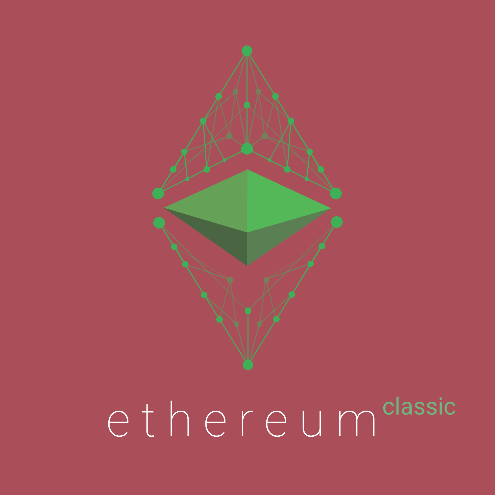

  
  

# Media Kit

Media and press professionals may use Ethereum Classic logos, trademarks, images and colors by referring and adhering to the instructions in the Brand Guidelines document.

# Brand Guidelines

Covers the general guidelines for use of the Ethereum Classic logo, colour pallete options, and other brand use general topics
Current version: v1.0.1 July 2016

# Ethereum Classic Logos

## ETC Logo

<table>
  <tbody>
    <tr>
      <td></td>
      <td></td>
      <td></td>
    </tr>
    <tr>
    <td></td>
    <td ></td>
    <td></td>
    </tr>
    <tr>
    <td></td>
    <td></td>
    <td></td>
    </tr>
    <tr>
    <td></td>
    <td>&nbsp;</td>
    <td></td>
    </tr>
  </tbody>
</table>

## ETC BaaS Cloud Logo

<table>
  <tbody>
    <tr>
      <td></td>
      <td></td>
      <td></td>
    </tr>
  </tbody>
</table>

## ETC EC Logo

<table>
  <tbody>
    <tr>
      <td></td>
      <td></td>
      <td></td>
    </tr>
  </tbody>
</table>

## ETC Fractal Logo

<table>
  <tbody>
    <tr>
      <td></td>
      <td></td>
      <td></td>
    </tr>
  </tbody>
</table>

## ETC Matte Logo

<table>
  <tbody>
    <tr>
      <td></td>
      <td width="250">&nbsp;</td>
      <td></td>
    </tr>
  </tbody>
</table>

## ETC Network Logo

<table>
  <tbody>
    <tr>
      <td></td>
      <td></td>
      <td></td>
      <td></td>
    </tr>
  </tbody>
</table>

## ETC Network Icon

<table>
  <tbody>
    <tr>
      <td></td>
      <td></td>
      <td></td>
    </tr>
  </tbody>
</table>

# Overview

A one page overview of the ethereumclassic project

# Press Releases

A collection of press releases by the ethereumclassic team

sitemap: https://ethereumclassic.org/press-kit

source: https://github.com/ethereumclassic/Media_Kit

# Press Kit

### Ethereum Classic Matte Logo
insert logo links

### Ethereum Classic Logo - Network
insert logo links

### Ethereum Classic Logo - Chinese

### Ethereum Classic Logo - Solid
