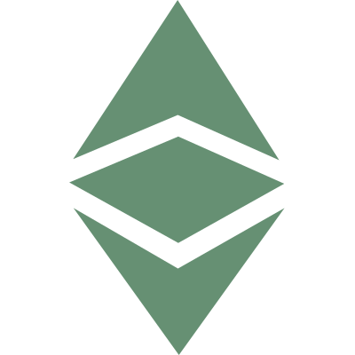
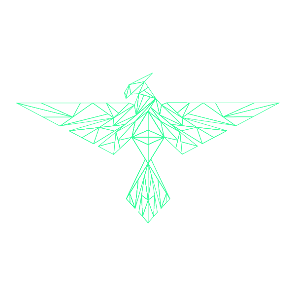

  
  

# Media Kit

Media and press professionals may use Ethereum Classic logos, trademarks, images and colors by referring and adhering to the instructions in the Brand Guidelines documents.

# Brand Guidelines

Covers the general guidelines for use of the Ethereum Classic logo, colour pallete options, and other brand use general topics
- [Ethereum_Classic_Brand_Use_Guidelines v1.0.1 July 2016](./Brand_Guidelines/Ethereum_Classic_Brand_Use_Guidelines_v1.0.1.pdf)
- [Phoenix Project October 2017](./Brand_Guidelines/Phoenix_Project_Design_Guidelines.pdf)

# Ethereum Classic Logos

<table>
  <tbody>
    <tr>
      <th colspan="3">ETC Logo</th>
    </tr>
    <tr>
    <td></td>
    <td ></td>
    <td></td>
    </tr>
    <tr>
      <td></td>
      <td></td>
      <td></td>
    </tr>
    <tr>
    <td></td>
    <td></td>
    <td></td>
    </tr>
    <tr>
    <td></td>
    <td>&nbsp;</td>
    <td></td>
    </tr>
  </tbody>
</table>
<table>
  <tbody>
    <tr>
      <th colspan="3">ETC BaaS Cloud Logo</th>
    </tr>
    <tr>
      <td></td>
      <td></td>
      <td></td>
    </tr>
    <tr>
      <th colspan="3">ETC EC Logo</th>
    </tr>
    <tr>
      <td></td>
      <td></td>
      <td></td>
    </tr>
    <tr>
      <th colspan="3">ETC Fractal Logo</th>
    </tr>
    <tr>
      <td></td>
      <td></td>
      <td></td>
    </tr>
    <tr>
      <th colspan="3">ETC Matte Logo</th>
    </tr>
    <tr>
      <td></td>
      <td>&nbsp;</td>
      <td></td>
    </tr>
    <tr>
      <th colspan="3">ETC Network Logo</th>
    </tr>
    <tr>
      <td></td>
      <td></td>
      <td></td>
    </tr>
    <tr>
      <th colspan="3">ETC Network Icon Logo</th>
    </tr>
    <tr>
      <td></td>
      <td></td>
      <td></td>
    </tr>
    <tr>
      <th colspan="3">ETC Phoenix Logo</th>
    </tr>
    <tr>
      <td></td>
      <td></td>
      <td></td>
    </tr>
    <tr>
      <td></td>
      <td></td>
      <td></td>
    </tr>
    <tr>
      <th colspan="3">Powered by ETC Logo</th>
    </tr>
    <tr>
      <td></td>
      <td></td>
      <td></td>
    </tr>
  </tbody>
</table>

# DAO Fork Response
- [Ethereum Classic - Motivation, Ideology, Goals](./DAO_Fork/motivation_ideology_goals.pdf) - July 2016

# ECIP-1017 - Ethereum Classic Monetary Policy
- [Monetary Policy Presentation](./ECIP-1017/ECIP-1017_monetary_policy_presentation.pdf) - December 2016
- [Thesis](./ECIP-1017/ECIP-1017_thesis.pdf) - December 2016

# Press Releases
- [Hardfork: Aztlan + Phoneix](./Hardforks/hardfork_aztlan_phoenix.md) - February 2020
